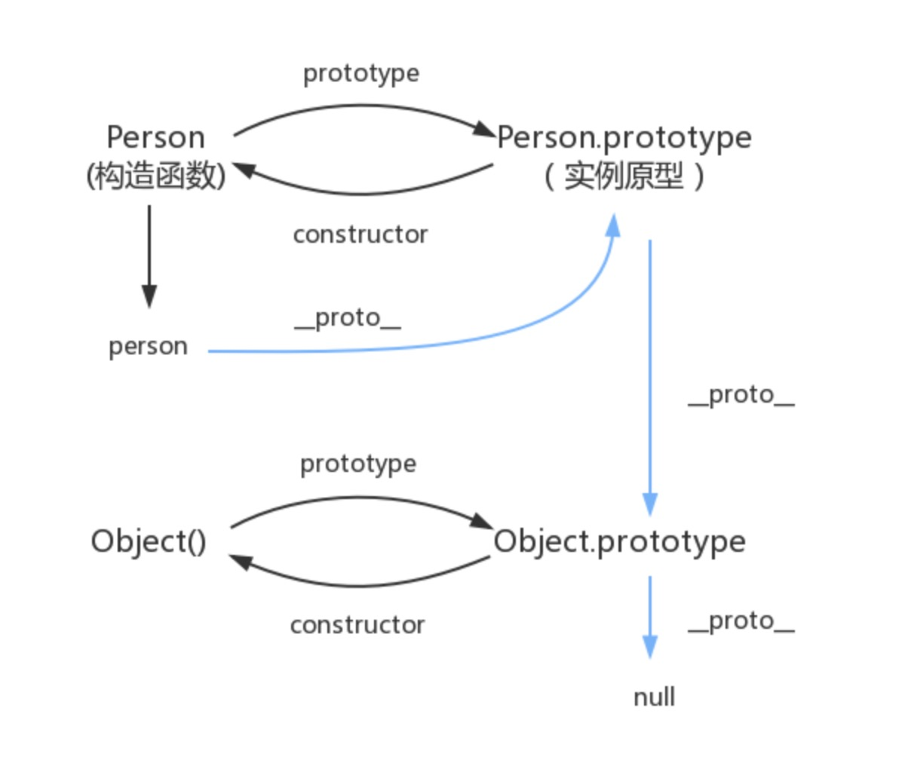

## 1.原型及原型链

```js

//首先通过new的方式创建了一个Person的实例对象
function Person() {}
const person = new Person();

//对象有__proto__ 函数有prototype

//指向关系
person.__proto__ === Person.prototype
Person.prototype.constructor === Person

//每个实例原型的原型都是Object.prototype
Object.prototype.__proto__ === null

//所以每个原型链的终点都是Object.prototype

//所以原型链即为下面蓝色的指向，属性及方法会沿链往下找到null为止

```



图引自[冴羽](https://github.com/mqyqingfeng)大佬的[issue](https://github.com/mqyqingfeng/Blog/issues/2)